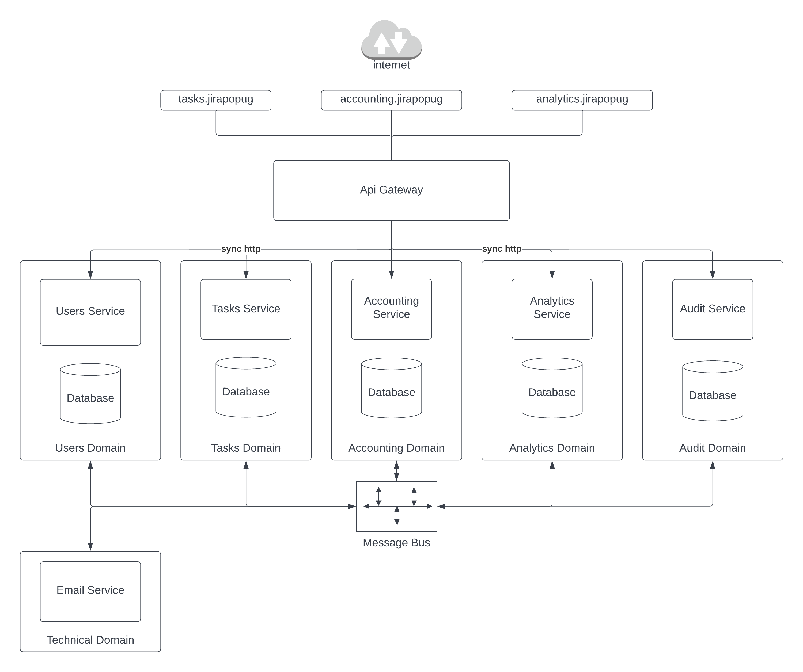

# jira-popug-edition
# Architecture
* Service per domain, services do not directly communicate with each other
* Services hold needed part of data not from own domain, updated through events
* Dashboards uses rest api
* Requests auth in Api Gateway
* Permissions checked in each service based on own user info (role)
* Events emitted after DB transaction commit



# Services
## Users Service
Users management and authentication
#### Data:
* Users: id, email, role, authInfo, timestamps

#### Rest Endpoints
* `POST /api/v1/signup` - Create new user
* `POST /api/v1/login` - Login
* `GET /api/v1/me` - Get current user

#### Produces
Business Events  (Q: or just CUD events + separate audit events?)
- `Users.Created` (id, name, role)
- `Users.RoleChanged` (id, newRole)
- `Users.Archived` (id)

## Tasks Service
Tasks management. Owns task data, except task price, which is gained from Accounting Service
#### Data
  * Users: id, email, role, timestamps
  * Tasks: id, title, assignPrice (nullable), completePrice(nullable), status, userId, timestamps
#### Rest Endpoints
* `POST /api/v1/tasks` - Create new task
  
  Body
  ```
  { 
    title: "task title" 
  }
  ```
  
* `GET /api/v1/tasks` - Get user tasks
* `POST /api/v1/tasks/:id/complete` - Complete user task
* `POST /api/v1/tasks/reshuffle` - Reshuffle all open tasks
#### Produces
Business Events
- `Tasks.Created` (id, title, userId)
- `Tasks.Completed` (id, userId)
- `Tasks.AssigneeChanged` (id, userId)

#### Consumes
Business Events
- `Users.Created` (Q: or separate CUD event?)
- `Users.RoleChanged` (Q: or separate CUD event?)
- `Users.Archived` (Q: or separate CUD event?)
- `Accounting.TaskPriceUpdated`

## Accounting Service
Manage user's account balance
#### Data
* Users: id, email, role
* Tasks: id, title
* BalanceInfo: id, userId, billableItemId, billableAction, amount, timestamps
#### Rest Endpoints
* `GET /api/v1/accounting/balance` - user balance
  * params: `date` - optional, date to show balance 
* `GET /api/v1/accounting/history` - user balance history
  * params: `date` - optional, date to show balance 

#### Produces
Business Events
- `Accounting.TaskPriceUpdated` (id, assignPrice, completePrice)
- `Accounting.Payouted` (userId, amount)
- `SendEmail` (to, title, body)

#### Consumes
Business Events
- `Tasks.Created`
- `Tasks.AssigneeChanged`
- `Tasks.Completed`
- `Users.Created` (Q: or separate CUD event?)
- `Users.RoleChanged` (Q: or separate CUD event?)
- `Users.Archived` (Q: or separate CUD event?)

## Analytics Service
Responsible to perform analytics based on system events.

#### Data
 * Users: id, role
 * Tasks: id, assignPrice, completePrice, createdAt

#### Rest Endpoints
* `GET /api/v1/analytics/stats`
  * params: `fromDate` - optional, date to stats 
  * params: `toDate` - optional, date to stats 

#### Consumes
Business Events
- `Tasks.Created`
- `Accounting.TaskPriceUpdated`
- `Users.Created` (Q: or separate CUD event?)
- `Users.RoleChanged` (Q: or separate CUD event?)
- `Users.Archived` (Q: or separate CUD event?)

## Audit Service
Responsible to track system actions
#### Data
  * AuditLog: id, userId, actionType, actionPayload
#### Rest Endpoint
* `GET /api/v1/audit_logs`
  * params: `fromDate` - optional, date to stats
  * params: `toDate` - optional, date to stats 
  * params: `type` - optional, type of audit actions 

#### Consumes
Business Events
- ??? (Q: process all BE or separate audit events?)

## Email Service
Technical service. Message should contain all needed information to send email.
#### Consumes
- `SendEmail`

# Workflows
#### Create new task
User -> Tasks Service -> emit `Tasks.Created` -> `Accounting.TaskPriceUpdated`
#### Tasks reshuffle
User -> Tasks Service -> emit per task `Tasks.AssigneeChanged`

# Problems
Complete task without price
Complete task, but assignee change in progress
